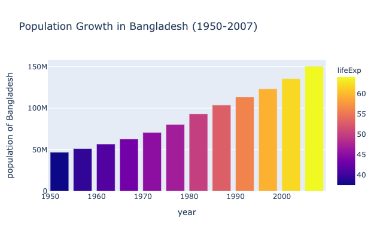
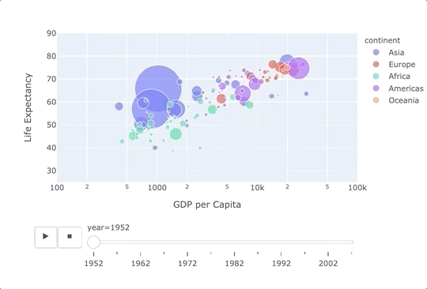
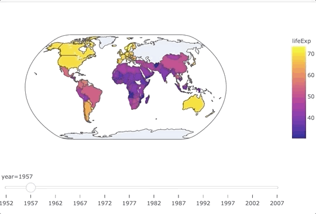
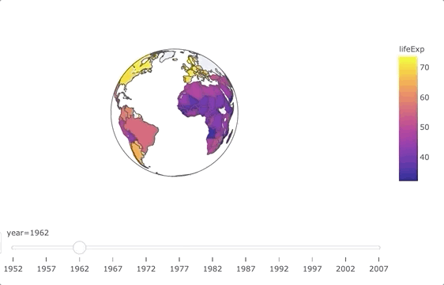

# Data is Beautiful

About the Data:
[Data Source](https://www.gapminder.org/tools/#$state$time$value=2007;;&chart-type=bubbles)

### This repository contains a [Jupyter Notebook](Interactive-DataViz.ipynb) with both interactive and animated visualizations of data that were created using [Plotly Express](https://plotly.com/python-api-reference/).

Some of the models are illustrated below. The animated data visualization models have been recorded using [Giphy Capture](https://giphy.com/apps/giphycapture):
 
### Graphing Population Growth of Bangladesh by Year

### Life Expectancy vs GDP per Capita Bubble Chart

### Geographic Data as Animated Maps

### Orthographic Projection of Earth

